# Cat Fish
SEI 5/9 Project 1: Cat Fish  
This game was inspired by the idea of Pac-Man and my cats, who are scared of certain fruits.

# User Story
The goal of the game is to move the cat around to catch all the fish on the board. The cat has to avoid touching the fruits and vegtables falling doown from the top of the game board, as that will cause the user to lose the game because cats are scared of certain fruits and vegtables. Every time a fish is caught, the score goes up. Everytime the game refreshes, there will always be a different kind of fish on the board.

To play the game, the user will have to use the <mark>UP</mark>, <mark>Down</mark>, <mark>LEFT</mark>, and <mark>RIGHT</mark> arrow keys on their keyboards. The cat simply has to touch the fish to catch it. Likewise with the fruit and vegtables, as one tocuh will cause the user to lose the game.

## Main Screen
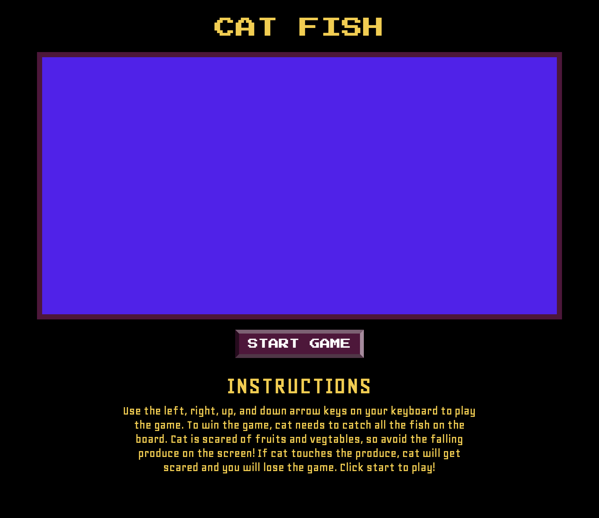

## Game Started
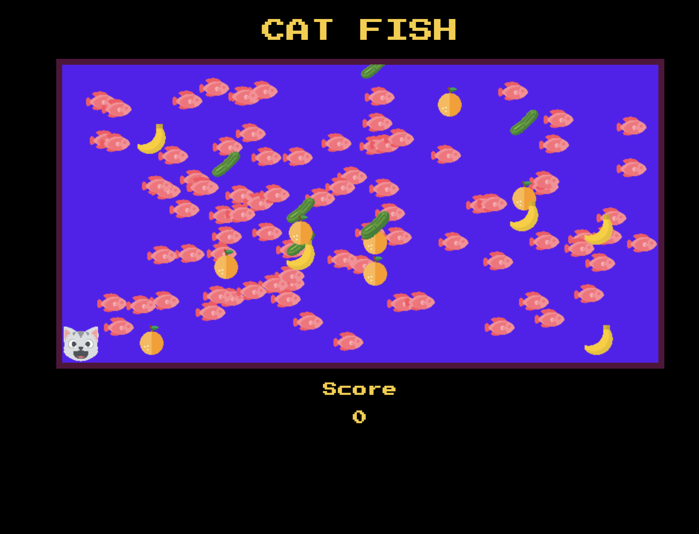

## Game Lost
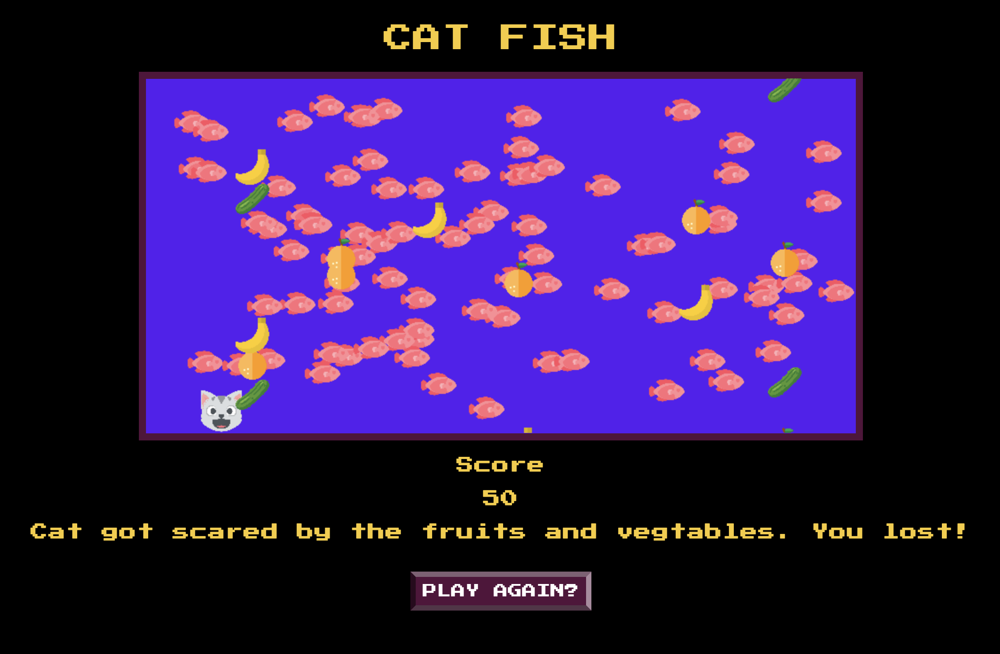

## Game Won
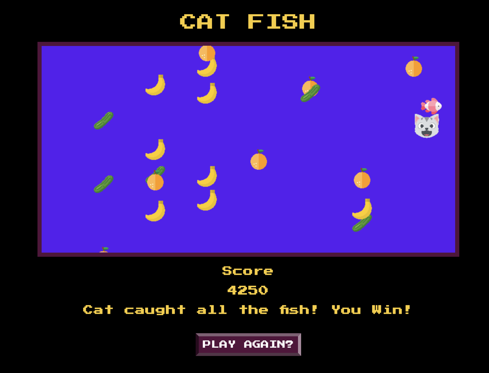

# Technologies Used
* HTML 
* CSS
* JavaScript (regular JS logic and DOM manipulation)
* Canvas
* All the images used in the game were found on an [open source free icon website](https://icons8.com/icons/set/open-source).

# How it Works
Everything that makes the game run is placed into a function called <mark>start()</mark>, which is called in an event listener on the start button.

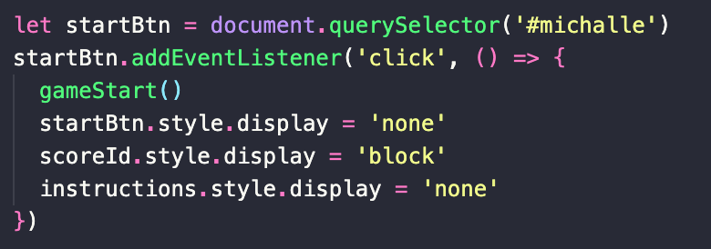

There are classes defined at the begining, in which the cat is created by the <mark>class Player</mark> and the fishes are created by the <mark>class Fishies</mark>

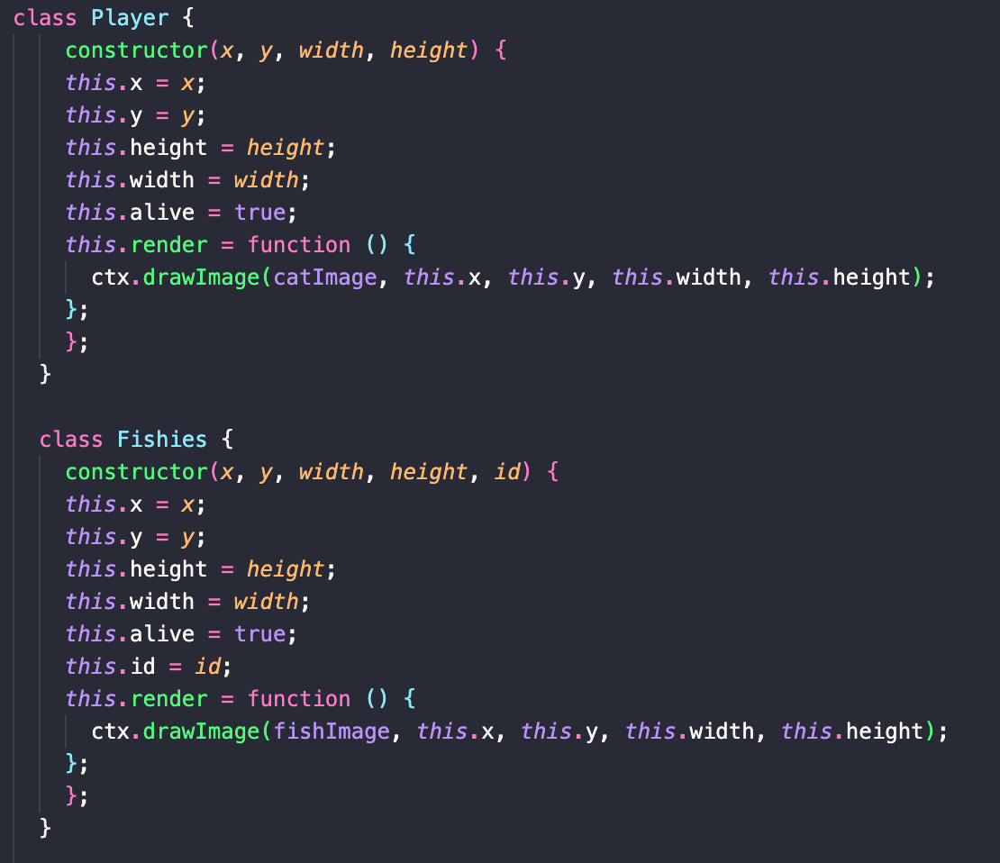

The cat and fish are then rendered in the <mark>gameLoop()</mark> function, and then created at the very begining of the <mark>start()</mark> function.

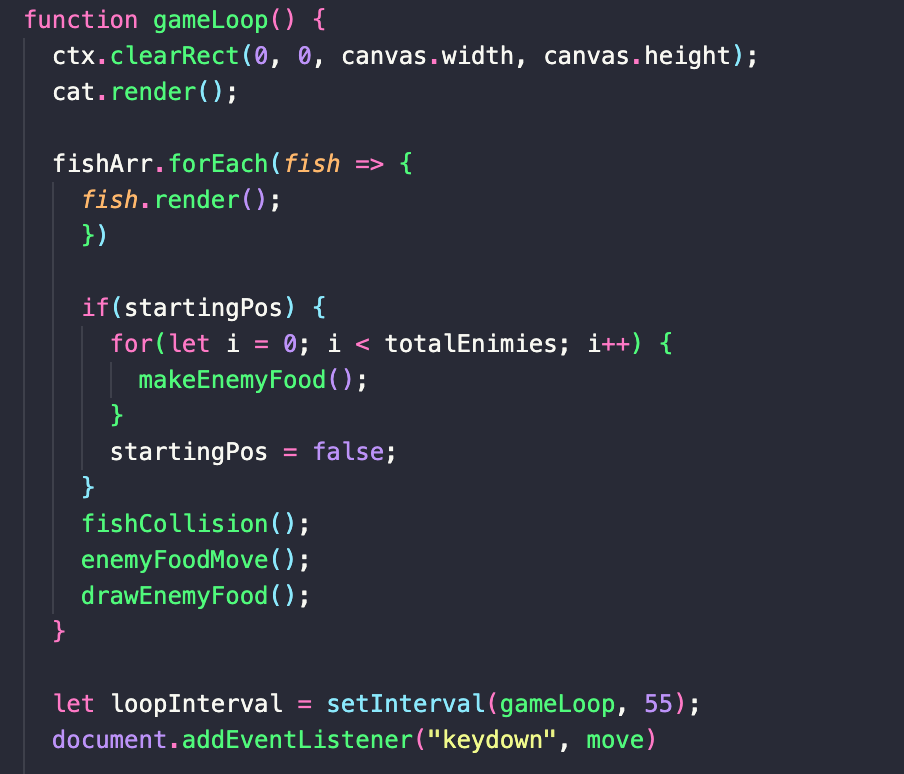
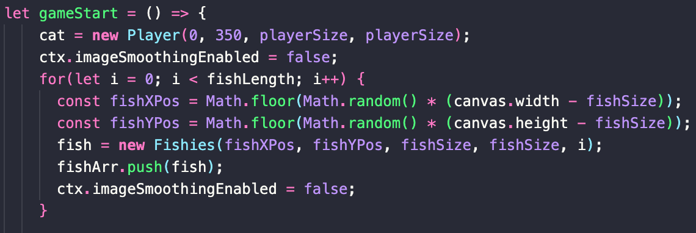

The fishes are rendered in a forEach loop for an array called <mark>fishArr</mark>, and then created within a for loop at the begining of start. 

 

The iterations of the for loop is random on each refresh/play of the game, because a random function was created to generate a random number between 30 and 100. This means that on each play of the game, there will be 30-100 random fishes placed randomly on to the game board.

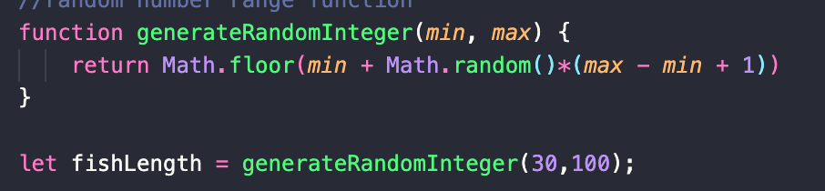

The vegtables are created by an object inside a function, which are then drawn in another function, and then called in the <mark>gameLoop()</mark>. The vegtables object is stored in an array.

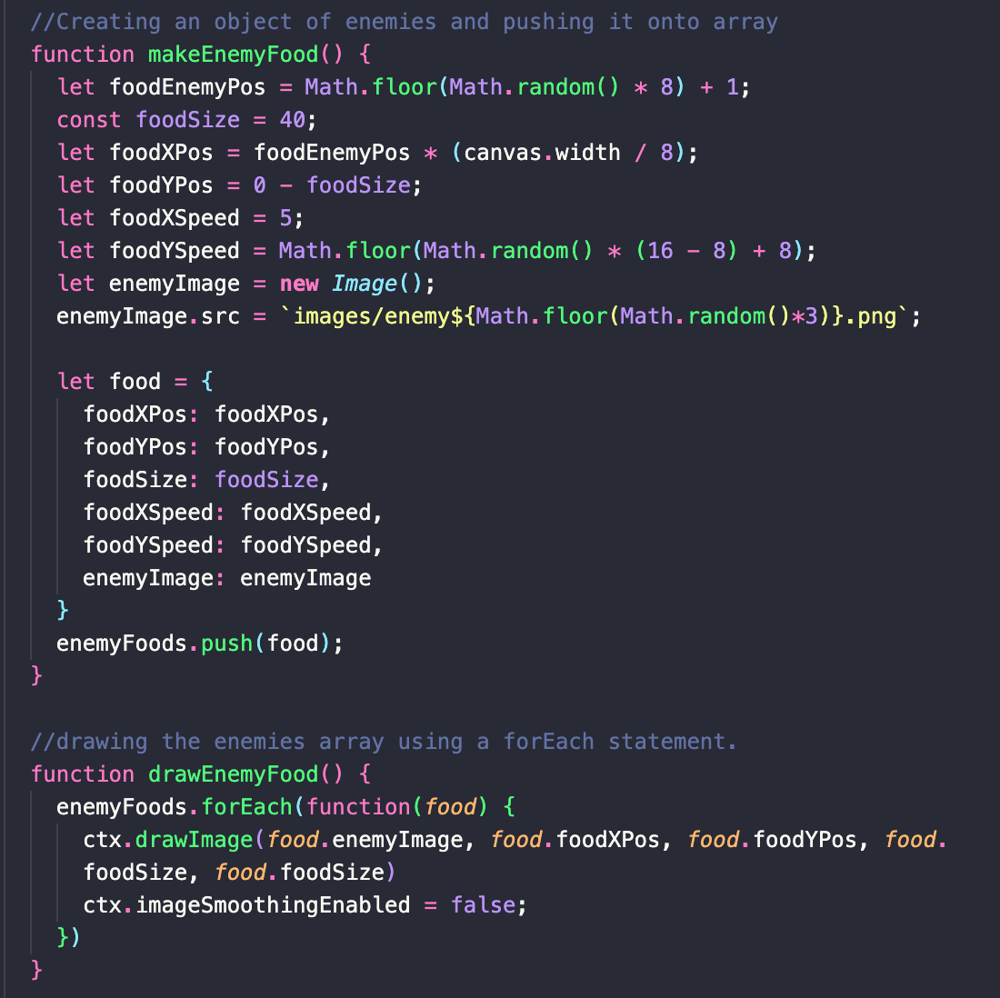

 

The next important piece of logic in the game is the collusion detections for the cat with the fish and the vegtables. The collusion detections are found by using the <mark>x and y coordinates</mark> of each element and then using their widths and heights.

 

When the fish collides with the cat, the fish disappear off the screen by getting the index of the fish that was hit, and then splicing the fish from the <mark>fishArr</mark> at the index. The player wins if the <mark>fishArr.length === 0</mark>.

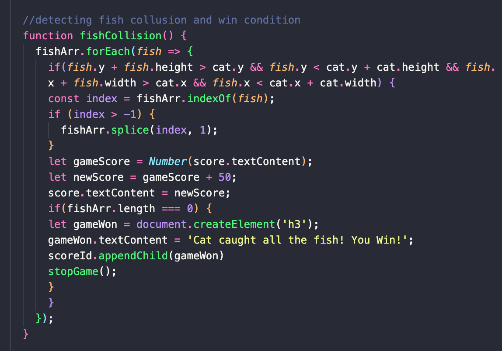

The collision detection function for the foods also includes the way in which the food is able to move and fall from the top of the screen, and how each of the foods fall at different speed rates. Most of this is dont by using the width and heights of the canvas and the images, and using the Math.Random function.

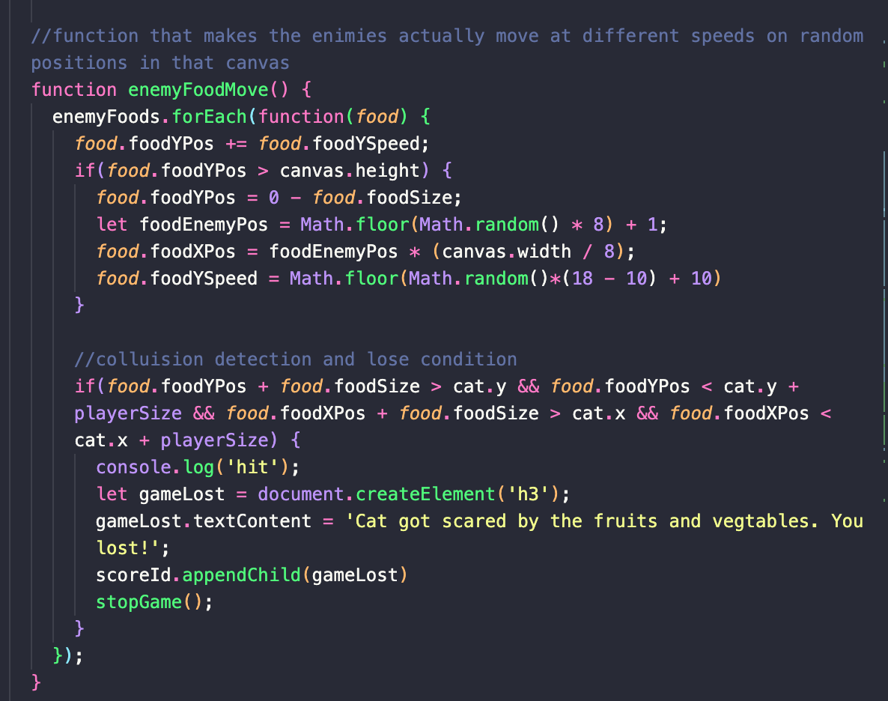

 

The collusion detections also include the <mark>stopGame()<mark> function, which stops the game with <mark>clearInterval()</mark>.

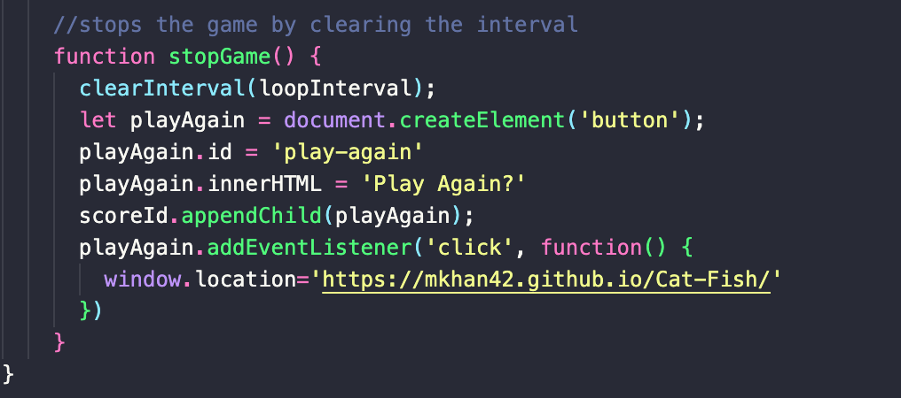

Lastly, the player is able to play the game by using the up, down, left, and right keys on the computer. This is able to occur because of the <mark>move()</mark> function. The move function uses conditionals to detect what keys were pressed, and the also has constraints so that the cat wont be able to move too far down or above, or too far right or left of the canvas.

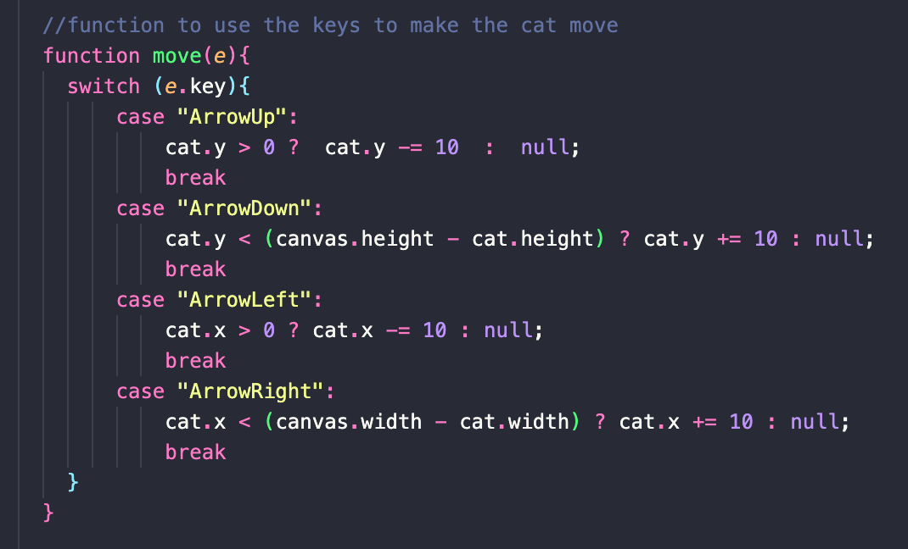

WireFrames and PseudoCode

# Future Considerations
Some future considerations to implement would be to create different levels and having a life system. The levels can include one level of having to catch fishes that move, and another one could be having to catch a certain amount of fishes within a timer. Another consideration that I am thinking about is making the game more like Pac-Man, and creating a maze, having the fruits and vegtables chase/follow the cat, and having a glowing fish that makes the fruits and vegtables edible for a quick second. I would also love to add sound to the game.
